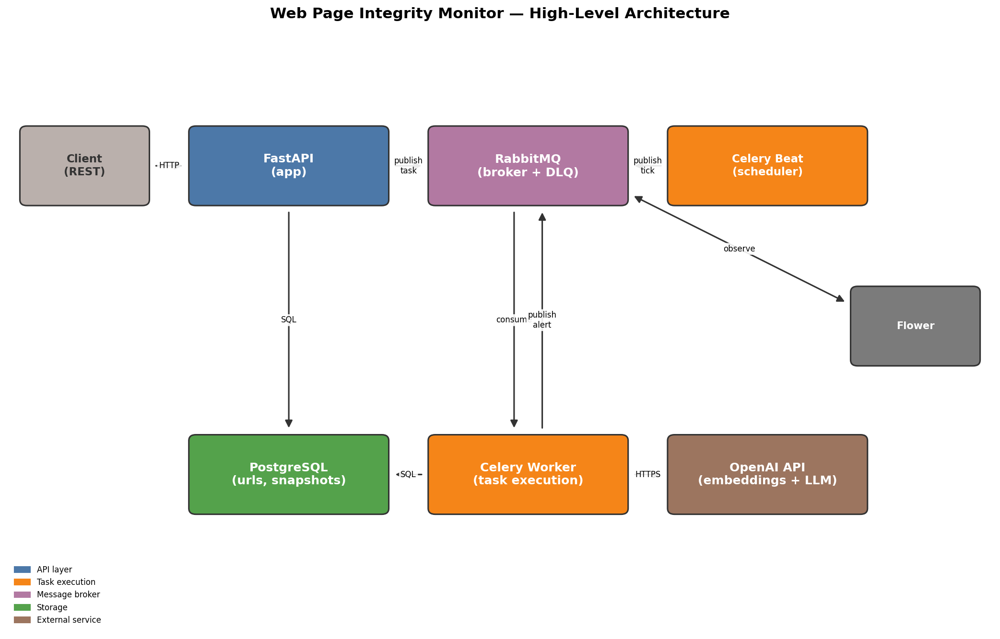
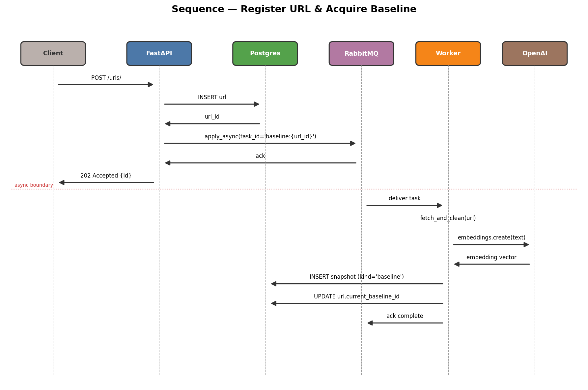
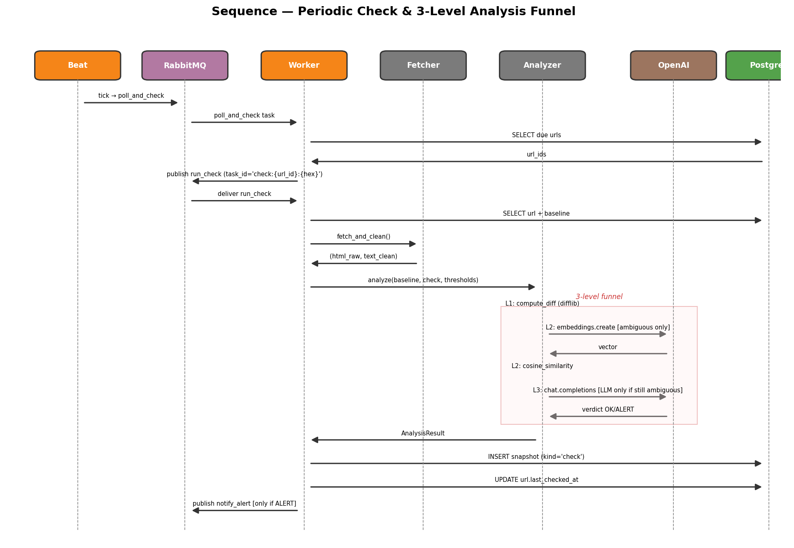
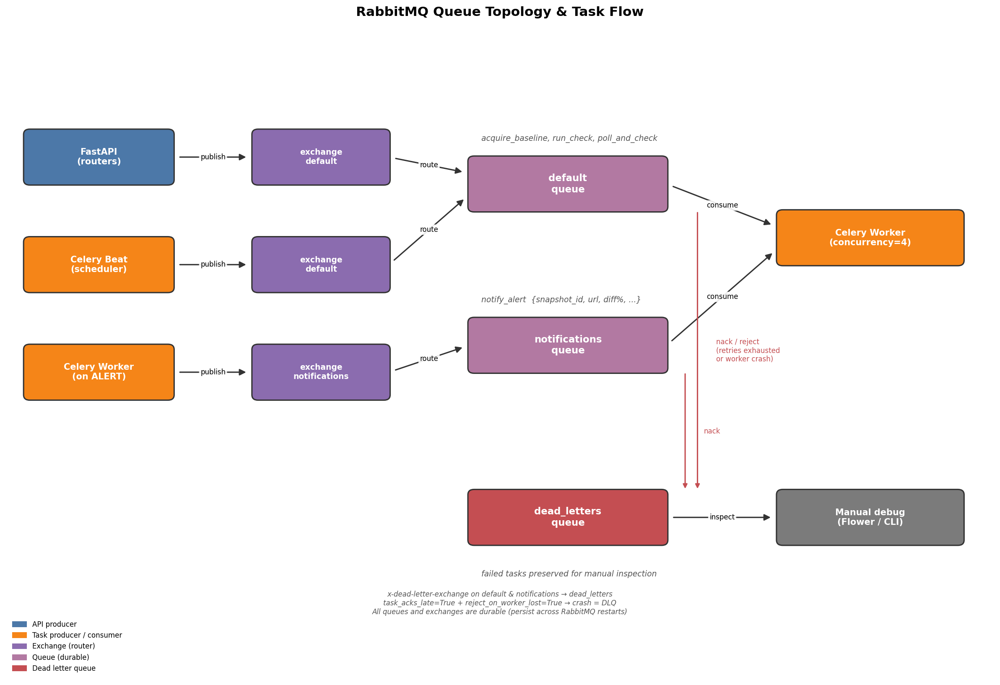
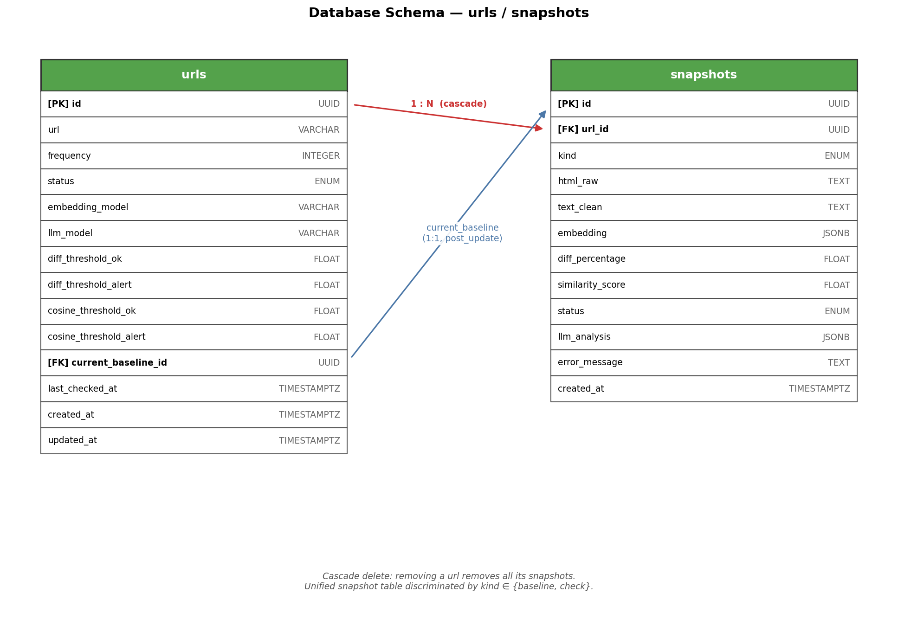

# Diagrammi

Diagrammi di architettura, sequenze operative e schema database.
Le immagini sono generate in `docs/images/` (vedi `/tmp/gen_diagrams.py` per
lo script matplotlib).

## 1. Architettura di sistema

Componenti principali e loro rapporti:

- **Client** → chiama l'API REST esposta da **FastAPI**.
- **FastAPI** persiste lo stato su **PostgreSQL** e pubblica task su
  **RabbitMQ**.
- **Celery Beat** emette tick periodici (`poll_and_check`).
- **Celery Worker** consuma i task, orchestra i moduli **services**
  (fetcher, analyzer, baseline, scheduler), scrive su Postgres e chiama
  **OpenAI** per embedding + LLM.
- I moduli `services` sono funzioni Python sync, riusati sia dai task che
  dagli endpoint API (es. `refresh_baseline`).

Le code RabbitMQ sono tre: `default` (task principali), `notifications`
(alert) e `dead_letters` (messaggi rigettati dopo retry).

---

## 2. Sequenza — registrazione URL e acquisizione baseline

1. `POST /urls/` → FastAPI persiste la riga e pubblica
   `wpim.acquire_baseline` con `task_id=baseline:{url_id}`.
2. Il client riceve `202 Accepted {id}` senza aspettare l'acquisizione.
3. Il worker consuma il task asincronamente: fetch, clean, embedding,
   insert snapshot (`kind='baseline'`), update `urls.current_baseline_id`.
4. In caso di errore il task viene ritentato (max 3). Esauriti i retry, il
   messaggio finisce in `dead_letters`.

La linea rossa segna il confine async: sotto, tutto avviene senza che il
client attenda.

---

## 3. Sequenza — check periodico e funnel a 3 livelli

1. **Beat** pubblica `poll_and_check` a ogni tick.
2. Il worker carica gli URL attivi, calcola quelli scaduti e pubblica
   un `run_check` per ognuno con `task_id=check:{url_id}:{hex}`.
3. Per ogni URL scaduto:
   - Carica snapshot baseline dal DB.
   - Esegue `fetch_and_clean` sulla pagina corrente.
   - Invoca `analyze()` sul pipeline:
     - **Livello 1 (sempre)**: `compute_diff` — decisione immediata se
       fuori soglie.
     - **Livello 2 (solo ambigui)**: `compute_embedding` + cosine
       similarity.
     - **Livello 3 (solo se ancora ambiguo)**: chunking diff-guided →
       `llm_classify` con fail-fast su primo ALERT.
   - Persiste lo snapshot `kind='check'` con `status`, `diff_percentage`,
     `similarity_score` e `llm_analysis`.
4. Se lo stato finale è `ALERT`, pubblica `wpim.notify_alert` sulla coda
   dedicata.

Il riquadro rosso nel diagramma evidenzia il funnel: più si scende, più
costa (OpenAI API call) — il sistema fa il possibile per risolvere ai
livelli 1 e 2.

---

## 4. Topologia code RabbitMQ

Tre code, tre exchange, una Dead Letter Queue:

### Producer
- **FastAPI** pubblica `wpim.acquire_baseline` su exchange `default` quando
  il client registra un nuovo URL (`POST /urls/`).
- **Celery Beat** pubblica `wpim.poll_and_check` su exchange `default` a
  ogni tick dello scheduler.
- **Celery Worker** pubblica `wpim.notify_alert` su exchange `notifications`
  quando un check risulta ALERT.

### Routing
- Exchange `default` (direct) → coda `default`: contiene `acquire_baseline`,
  `run_check`, `poll_and_check`.
- Exchange `notifications` (direct) → coda `notifications`: contiene solo
  `notify_alert`. Separata per evitare che gli alert restino in coda
  dietro a centinaia di check.
- Entrambe le code dichiarano `x-dead-letter-exchange=dead_letters`.

### Dead Letter Queue
- Exchange `dead_letters` (fanout) → coda `dead_letters`.
- Ci finiscono i messaggi rifiutati (nack) dopo esaurimento dei retry
  (`acquire_baseline` dopo 3 tentativi) o per crash del worker process
  (`task_acks_late=True` + `reject_on_worker_lost=True`).
- I messaggi nella DLQ non vengono persi: restano disponibili per debug
  manuale via Flower o CLI (`celery inspect`).

### Configurazione chiave
- `durable=True` su tutte le code e gli exchange: sopravvivono a un
  restart di RabbitMQ.
- `task_acks_late=True`: il messaggio viene confermato solo dopo
  l'esecuzione completa del task, non al momento della ricezione.
- Serializzazione JSON per leggibilità e debug.

---

## 5. Schema del database

Due tabelle:

### `urls`
Config della pagina monitorata:
- `id` (PK, UUID)
- `url` (unique, normalizzato)
- `frequency` (secondi tra un check e l'altro)
- `status` ENUM `active|inactive`
- `embedding_model`, `llm_model` (immutabili dopo creazione)
- 4 soglie di analisi (`diff_*`, `cosine_*`)
- `current_baseline_id` → FK a `snapshots.id` (head pointer, `post_update=True`)
- `last_checked_at`, `created_at`, `updated_at`

### `snapshots`
Tabella unificata per baseline e check, discriminata da `kind`:
- `id` (PK, UUID)
- `url_id` (FK a `urls.id`, `ON DELETE CASCADE`)
- `kind` ENUM `baseline|check`
- `html_raw`, `text_clean`
- `embedding` JSONB (array di float, salvato anche per i check a fini
  storici)
- Campi specifici dei check (NULL per baseline):
  `diff_percentage`, `similarity_score`, `status`, `llm_analysis`,
  `error_message`
- `created_at`

### Relazioni
- `urls (1) ↔ (N) snapshots` — ogni URL ha baseline storiche e check
  storici, tutti nella stessa tabella.
- `urls.current_baseline_id → snapshots.id` — puntatore alla baseline
  attiva. Il refresh baseline è **non distruttivo**: inserisce una nuova
  riga e sposta il puntatore. Le baseline precedenti restano per audit.

### Indici
- `snapshots(url_id, kind, created_at)` — copre le query di storia per
  entrambi i tipi di snapshot.
- `urls(status, last_checked_at)` — query dello scheduler.

### Cascade
Eliminare un `url` rimuove tutti i suoi `snapshots` via `ON DELETE CASCADE`.
Il FK circolare `urls.current_baseline_id → snapshots.id` è dichiarato con
`use_alter=True` in SQLAlchemy e `DEFERRABLE` in Postgres.
